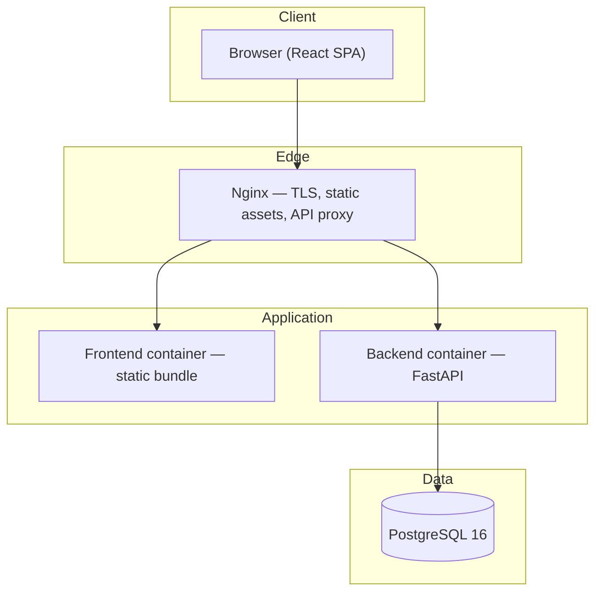
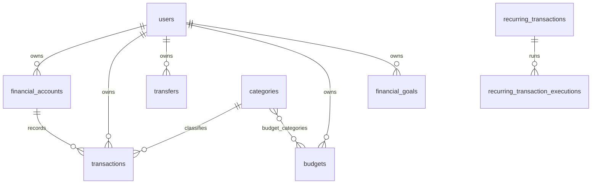
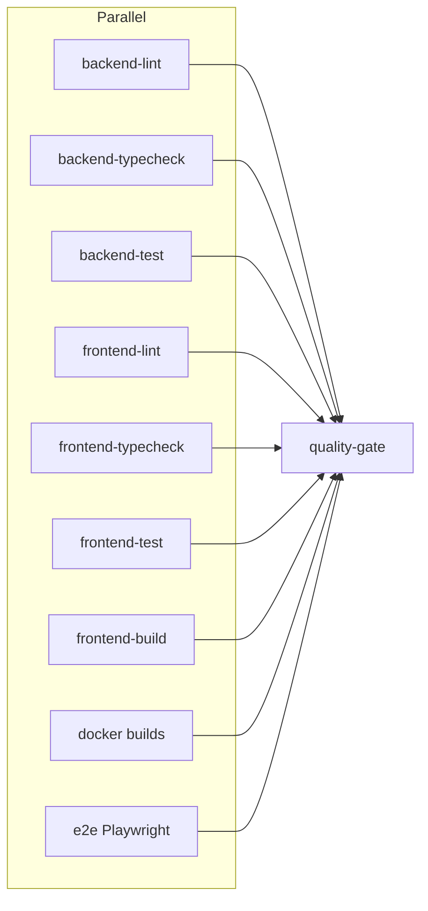

# Monetra

A full-stack personal finance platform built to demonstrate production-oriented software engineering: exact-decimal money handling, layered API design, containerized deployment, automated quality gates, and operational runbooks for a single-host AWS deployment.

---

## What it is

Monetra is a personal finance application for tracking income and expenses, managing accounts and categories, setting budgets and savings goals, and analyzing cash flow. It consists of:

- A **versioned REST API** (`/api/v1/`) implemented in FastAPI
- A **React SPA** with feature-oriented modules, server-state caching, and form validation
- **PostgreSQL** as the system of record
- **Docker Compose** for local development and production-shaped deployments on AWS EC2

The product specification lives in [SPECIFICATIONS.md](./SPECIFICATIONS.md). This README summarizes the engineering work; deeper references are linked throughout.

---

## Why it exists

Most tutorial finance apps stop at CRUD demos. Monetra was built to practice problems that appear in real systems:

| Problem | How Monetra addresses it |
|---------|---------------------------|
| Monetary precision | `NUMERIC` / `Decimal` everywhere — no floating-point balances |
| Multi-tenant data isolation | Server-side ownership checks on every resource |
| Long-lived browser sessions | Short-lived JWT access tokens + HttpOnly refresh cookies |
| Operational readiness | Health/readiness probes, backups, CI/CD, deployment runbooks |
| Maintainability at scale | Layered backend, feature folders in the frontend, ADRs for major decisions |

The scope is intentionally bounded: one user, one deployment topology, no microservices. The focus is correctness, testability, and deployability rather than feature breadth.

---

## Main capabilities

All items below are implemented end-to-end (API + UI unless noted).

| Area | Capabilities |
|------|----------------|
| **Auth** | Registration, login, JWT access tokens, HttpOnly refresh cookies, password reset (API; email not wired) |
| **Accounts** | Cash, bank, savings, and credit accounts with computed balances |
| **Transactions** | Income/expense CRUD, filtering, soft delete, CSV export |
| **Transfers** | Same-currency inter-account transfers with idempotency |
| **Recurring** | Scheduled income/expense templates; `process-due` via API (no background scheduler) |
| **Categories** | User-defined and system categories |
| **Budgets** | Period-based spending limits with utilization tracking |
| **Goals** | Savings targets with progress |
| **Analytics** | Income vs expenses, cash flow trends, spending by category, budget utilization, period comparison |
| **Import / export** | CSV import wizard with preview; transaction CSV export |
| **Notifications** | In-app notification center and email preference toggles |
| **Dashboard** | Summary widgets, recent activity, rule-based insights |
| **Audit** | `audit_events` table and API — no frontend audit UI |

### Known limitations

These are deliberate gaps or deferred work; they are not hidden behind placeholders:

- **Email delivery** — `NoOpNotificationProvider` logs only; password-reset tokens are created but not emailed
- **Recurring scheduler** — `POST /api/v1/recurring-transactions/process-due` must be called explicitly
- **Exchange rates** — `none`, `static`, or `test` providers only; no live vendor API
- **Cross-currency transfers** — UI requires matching account currencies
- **Settings** — profile display only; reporting currency is set at registration
- **Observability** — OTEL/Sentry configuration hooks exist; SDK wiring is incomplete

---

## Architecture

Monetra follows a classic three-tier layout with a reverse proxy in front.



### Backend layers

```text
api/          HTTP handlers, request/response schemas, dependency injection
services/     Business workflows, orchestration, notification dispatch
repositories/ Data access, query composition
domain/       Pure financial logic (balances, analytics, CSV parsing)
models/       SQLAlchemy ORM models
```

Financial calculations live in `domain/` and `services/` — not duplicated in handlers or React components.

### Frontend structure

```text
src/features/     One folder per domain (accounts, transactions, analytics, …)
src/api/          Central HTTP client with auth refresh interceptor
src/components/   Shared UI primitives, layout, and state components
```

Server state is managed with **TanStack Query**. Forms use **React Hook Form + Zod**.

Full diagrams and API index: [docs/architecture.md](./docs/architecture.md).

---

## Technology stack

| Layer | Technologies |
|-------|--------------|
| **Backend** | Python 3.13+, FastAPI, Pydantic v2, SQLAlchemy 2.x, Alembic, PostgreSQL 16, psycopg 3 |
| **Frontend** | React 19, TypeScript, Vite 6, TanStack Query, React Hook Form, Zod, React Router 7, Recharts |
| **Quality** | Ruff, mypy, pytest; ESLint, Prettier, Vitest, Playwright |
| **Infrastructure** | Docker, Docker Compose, Nginx, GitHub Actions, AWS EC2 |

---

## Database design

PostgreSQL 16 stores all authoritative data. **17 tables** cover users, accounts, transactions, transfers, recurring schedules, budgets, goals, exchange rates, imports, notifications, and audit events.



| Design choice | Rationale |
|---------------|-----------|
| `NUMERIC` columns | Exact decimal arithmetic for all monetary values |
| Composite ownership FKs | `transactions.user_id` tied to `financial_accounts.user_id` prevents cross-tenant references |
| Soft delete on transactions | `deleted_at` reverses balance impact while retaining history |
| Alembic migrations | Schema changes are versioned; no `create_all` on startup |
| `exchange_rates` global table | Historical FX snapshots keyed by pair and date for analytics |

Schema reference, constraints, and migration workflow: [docs/database.md](./docs/database.md).

---

## Authentication and security

### Authentication model

Dual-token strategy documented in [ADR 002](./docs/adr/002-authentication-strategy.md):

| Token | Storage | Lifetime | Purpose |
|-------|---------|----------|---------|
| Access (JWT) | In-memory (React context) | ~15 minutes | `Authorization: Bearer` on API calls |
| Refresh (opaque) | HttpOnly cookie (`/api/v1/auth`) | ~14 days | Silent re-authentication; rotated on each refresh |

Passwords are hashed with **Argon2id**. Refresh tokens are stored hashed server-side and can be revoked on logout.

### Authorization and hardening

- **Ownership checks** on every mutating and read-by-id endpoint — no client-side-only authorization
- **Rate limiting** on auth and password-reset routes
- **Production config validation** — rejects default JWT secrets, `DEBUG=true`, and wildcard CORS
- **Security headers** via middleware; TLS termination at Nginx in production
- **Secrets** in `.env` only — never baked into images or committed to Git
- **Non-root containers** verified in CI

API reference: [docs/api-auth.md](./docs/api-auth.md).

---

## Testing strategy

Testing is layered to catch regressions at the appropriate boundary.

| Layer | Tooling | Scope | Count (approx.) |
|-------|---------|-------|-----------------|
| Backend unit / integration | pytest + PostgreSQL service | Domain logic, API contracts, security, balance invariants | 444 |
| Frontend unit | Vitest + Testing Library | Components, schemas, API client, navigation | 116 |
| End-to-end | Playwright | Auth flows, CRUD journeys, import/export, accessibility smoke | 22 |
| Load (local only) | httpx asyncio runner | Representative API journeys under concurrency | `backend/loadtest/` |
| Resilience | pytest | Production failure scenarios (DB down, bad config) | `backend/tests/resilience/` |

```bash
# Local quality gate (lint, typecheck, unit tests, frontend build, Docker builds)
make verify
# Windows: .\scripts\dev.ps1 verify

# E2E (requires running backend; CI runs these automatically)
cd frontend && npm run test:e2e
```

E2E tests run in CI but are **not** part of `make verify` — run them locally before large UI changes.

Details: [docs/testing.md](./docs/testing.md).

---

## CI/CD

Two GitHub Actions workflows:

| Workflow | Trigger | Purpose |
|----------|---------|---------|
| [ci.yml](./.github/workflows/ci.yml) | PRs and pushes to `main` | Full quality gate |
| [deploy-production.yml](./.github/workflows/deploy-production.yml) | Tag `v*` or manual dispatch | Deploy to EC2 after CI passes |

### CI jobs



The Docker job builds both dev and production Compose images. CI exports ephemeral `POSTGRES_*` and `JWT_SECRET_KEY` values for Compose interpolation — these are not production secrets.

Deploy workflow: re-runs CI on the target ref, SSHs to EC2, checks out the release, builds images, runs Alembic migrations, and restarts services. Optional pre-deploy database backup when `BACKUP_BEFORE_DEPLOY=true`.

Full pipeline reference: [docs/deployment/github-actions.md](./docs/deployment/github-actions.md).

---

## AWS deployment

Production runs on a **single EC2 instance** with Docker Compose — no Kubernetes. This matches [ADR 006](./docs/adr/006-deployment-strategy.md) and keeps operational overhead low for a portfolio deployment.

```text
Internet → Route 53 (A/AAAA) → Elastic IP → EC2
                                              ├── Security group: 22, 80, 443
                                              └── docker-compose.prod.yml
                                                    ├── nginx      (:80 / :443, TLS)
                                                    ├── frontend   (internal)
                                                    ├── backend    (internal, Alembic on start)
                                                    └── postgres   (Docker volume)
```

| Concern | Approach |
|---------|----------|
| TLS | Let's Encrypt via Nginx; local prod-shaped testing with self-signed certs |
| Backups | Daily `pg_dump` with retention; optional S3 off-host storage |
| Migrations | Alembic `upgrade head` on backend container start |
| Health | `GET /health` (liveness), `GET /ready` (PostgreSQL connectivity) |
| Rollback | Previous image tag + Alembic downgrade procedure in runbook |

Deployment docs: [docs/deployment/](./docs/deployment/).

---

## Screenshots and demo

No screenshots are committed to this repository. Evaluate the application locally:

```bash
cp .env.example .env
docker compose up --build -d
cd frontend && npm install && npm run dev
```

| What to explore | URL |
|-----------------|-----|
| App (via Nginx proxy) | http://localhost |
| Frontend dev server | http://localhost:5173 |
| OpenAPI interactive docs | http://localhost:8000/docs |
| Health / readiness | http://localhost:8000/health , `/ready` |

Register a user, create accounts, add transactions, and open the Analytics and Dashboard pages to see the full UI. To add portfolio screenshots later, place images under `docs/screenshots/` and reference them here.

---

## Local development

### Prerequisites

- Docker and Docker Compose
- Python 3.13+ (backend tooling)
- Node.js 22+ (frontend tooling)

### Quick start (Docker + host Vite)

```bash
cp .env.example .env
docker compose up --build -d
cd frontend && npm install && npm run dev
```

| Service | How it runs | URL |
|---------|-------------|-----|
| PostgreSQL | Docker | `localhost:5432` |
| Backend API | Docker | http://localhost:8000 |
| Nginx | Docker | http://localhost |
| Frontend (Vite) | Host process | http://localhost:5173 |

Nginx proxies `/`, `/api`, `/health`, and `/ready` to the appropriate upstream.

### Backend-only local run

```bash
docker compose up postgres -d
cd backend
python -m pip install -e ".[dev]"
alembic upgrade head
uvicorn app.main:app --reload --port 8000
```

Set `VITE_PROXY_TARGET=http://127.0.0.1:8000` when Playwright cannot reach the API through the default proxy.

Extended workflow: [docs/development.md](./docs/development.md).

---

## Production deployment

```bash
# On EC2 (after host setup — see docs/deployment/aws-ec2.md)
git clone <repo-url> /opt/monetra && cd /opt/monetra
git checkout <release-tag>
cp .env.production.example .env
# Edit secrets, domain, CORS — docs/deployment/configuration.md

docker compose -f docker-compose.prod.yml build
docker compose -f docker-compose.prod.yml up -d

curl -f http://127.0.0.1/nginx-health
curl -k -f https://<your-domain>/ready
```

Local prod-shaped verification before pushing:

```bash
./scripts/generate-local-tls-certs.sh   # self-signed certs for local test
./scripts/dev.sh prod-verify            # Windows: .\scripts\dev.ps1 prod-verify
```

Runbook: [docs/deployment/deploy.md](./docs/deployment/deploy.md).  
Backup/restore: [docs/deployment/backup-restore.md](./docs/deployment/backup-restore.md).

### Key environment variables

| Variable | Purpose |
|----------|---------|
| `DATABASE_URL` | PostgreSQL connection string |
| `JWT_SECRET_KEY` | Access-token signing key (≥ 32 characters in production) |
| `CORS_ORIGINS` | Allowed browser origins (comma-separated) |
| `REFRESH_TOKEN_COOKIE_*` | HttpOnly refresh cookie settings |
| `EXCHANGE_RATE_PROVIDER` | `none`, `static`, or `test` |

Full reference: [docs/deployment/configuration.md](./docs/deployment/configuration.md).

---

## Engineering decisions

Major decisions are recorded as Architecture Decision Records in [docs/adr/](./docs/adr/):

| ADR | Decision |
|-----|----------|
| [001](./docs/adr/001-backend-architecture.md) | Layered FastAPI backend (api → services → repositories → domain) |
| [002](./docs/adr/002-authentication-strategy.md) | JWT access + HttpOnly refresh cookie with Argon2id |
| [003](./docs/adr/003-money-representation.md) | `Decimal` / PostgreSQL `NUMERIC` — no floats |
| [004](./docs/adr/004-database-strategy.md) | PostgreSQL with Alembic migrations, soft-delete transactions |
| [005](./docs/adr/005-frontend-state-management.md) | TanStack Query for server state; no global client store |
| [006](./docs/adr/006-deployment-strategy.md) | Single EC2 + Docker Compose for production |

Additional conventions enforced in [AGENTS.md](./AGENTS.md):

- Paginated list endpoints with enforced max page size
- Stable API error shape: `{ "error": { "code", "message", "details" } }`
- No schema mutation on application startup
- Financial logic centralized in backend domain layer

---

## Future improvements

Ordered by impact relative to current gaps:

| Priority | Item | Notes |
|----------|------|-------|
| High | Outbound email (SMTP/SES) | Wire `NotificationProvider` for password reset and alerts |
| High | Recurring transaction scheduler | Background job or cron calling `process-due` |
| Medium | Live exchange-rate provider | Replace static/test providers for multi-currency analytics |
| Medium | Settings UI for reporting currency | `PATCH /users/me` exists; frontend editor missing |
| Medium | Audit trail UI | API and `audit_events` table exist |
| Medium | OpenTelemetry / Sentry SDK wiring | Config hooks present |
| Low | Cross-currency transfer UI | Backend constraints may need review |
| Low | Hosted demo environment | Separate EC2 or staging stack with anonymized seed data |
| Low | Portfolio screenshots | Capture and commit under `docs/screenshots/` |

---

## Repository structure

```text
backend/          FastAPI application, Alembic migrations, pytest, load tests
frontend/         React + Vite, Vitest unit tests, Playwright E2E
nginx/            Reverse proxy configurations (dev and production)
docker/           Shared container assets (Postgres init)
docs/             Architecture, API reference, deployment runbooks, ADRs
scripts/          Cross-platform development and deployment helpers
.github/workflows CI and production deployment
```

---

## Documentation index

| Document | Description |
|----------|-------------|
| [SPECIFICATIONS.md](./SPECIFICATIONS.md) | Authoritative product and engineering specification |
| [AGENTS.md](./AGENTS.md) | AI agent development rules |
| [docs/architecture.md](./docs/architecture.md) | System architecture and API index |
| [docs/database.md](./docs/database.md) | Schema, ER diagram, migrations |
| [docs/development.md](./docs/development.md) | Development workflow |
| [docs/testing.md](./docs/testing.md) | Unit, integration, and E2E testing |
| [docs/troubleshooting.md](./docs/troubleshooting.md) | Common issues and fixes |
| [docs/api-auth.md](./docs/api-auth.md) | Authentication API |
| [docs/deployment/](./docs/deployment/) | AWS EC2 production deployment |
| [docs/adr/](./docs/adr/) | Architecture decision records |
| `docs/api-*.md` | Per-domain API reference |

---

## License

Proprietary / portfolio project — rights reserved by the author unless otherwise stated.
