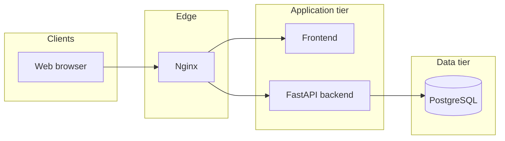
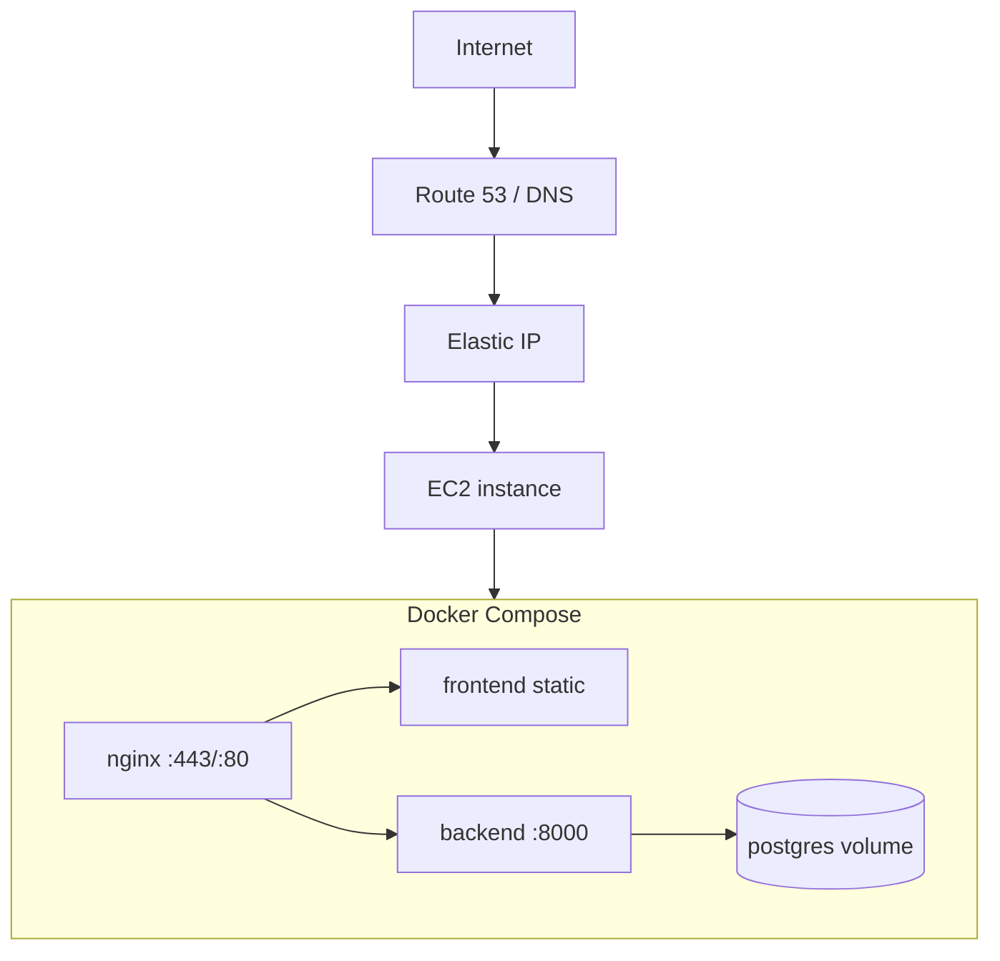

# Architecture overview

Monetra is a personal finance application with a **FastAPI** backend, **React** frontend, **PostgreSQL** database, and **Nginx** reverse proxy. Financial calculations and authorization live on the server; the frontend is a thin client over a versioned REST API.

## System context



## Development topology

```text
Browser → localhost:80 (Nginx in Docker)
              ├── /api, /health, /ready → backend:8000 (Docker)
              └── /                     → host.docker.internal:5173 (Vite on host)

PostgreSQL → postgres:5432 (Docker volume: postgres_data)
```

On Windows/macOS, Nginx reaches the host Vite server via `host.docker.internal`. Linux hosts may need `extra_hosts` in Compose.

## Production deployment topology



Production details: [deployment/README.md](./deployment/README.md).

## Backend layers

```text
api/           HTTP routers, dependency injection, exception handlers
services/      Use-case orchestration, transactions, side effects
domain/        Pure financial rules; password policy; shared domain errors
repositories/  Persistence queries and mutations
models/        SQLAlchemy ORM models
schemas/       Pydantic request/response models
db/            Engine, async sessions, declarative base
core/          Settings, logging, security, middleware, telemetry hooks
providers/     Exchange-rate and notification provider abstractions
```

Request flow:

```text
HTTP request
  → middleware (request ID, security headers, rate limits)
  → api handler (auth dependency, validation)
  → service (orchestration, domain rules)
  → repository (SQLAlchemy)
  → PostgreSQL
```

### Cross-cutting concerns

| Concern | Implementation |
|---------|----------------|
| Request correlation | `X-Request-ID` header; structured logs with `request_id` |
| Errors | `AppError` → `{ "error": { "code", "message", "details" }, "request_id" }` |
| Authentication | JWT bearer access tokens; HttpOnly refresh cookie |
| Authorization | `user_id` scoping on every query and mutation |
| Money | `Decimal` in Python; `NUMERIC` in PostgreSQL — never `float` |
| Migrations | Alembic only — no schema changes on application startup |
| Health | `GET /health` (liveness), `GET /ready` (PostgreSQL connectivity) |

Entry point: `backend/app/main.py`.

## Frontend organization

```text
src/
  api/         Central HTTP client, error parsing
  features/    Feature modules (auth, accounts, transactions, analytics, …)
  components/  Shared UI (layout, forms, states, design system)
  pages/       Top-level route screens (dashboard)
  routes/      React Router configuration
  lib/         Utilities (money formatting, query client, navigation)
  types/       Shared TypeScript types
```

| Pattern | Choice |
|---------|--------|
| Server state | TanStack Query |
| Forms | React Hook Form + Zod |
| Routing | React Router 7 with protected routes |
| Styling | CSS custom properties in `index.css` (no component library) |

Entry point: `frontend/src/main.tsx`.

### Implemented UI routes

```text
/login, /register, /forgot-password, /reset-password
/dashboard
/accounts, /accounts/:id
/transactions, /transactions/new, /transactions/:id
/transfers
/recurring, /recurring/:id
/categories
/budgets, /budgets/:id
/goals, /goals/:id
/analytics
/import
/notifications
/settings
```

## API surface

All business endpoints mount under `/api/v1/`. OpenAPI is available at `/docs` when `APP_ENV` is not `production`.

| Area | Prefix | Documentation |
|------|--------|---------------|
| Auth | `/api/v1/auth` | [api-auth.md](./api-auth.md) |
| Users | `/api/v1/users` | Reporting currency via `GET/PATCH /me` |
| Accounts & categories | `/api/v1/accounts`, `/categories` | [api-accounts-categories.md](./api-accounts-categories.md) |
| Transactions | `/api/v1/transactions` | [api-transactions.md](./api-transactions.md) |
| Transfers | `/api/v1/transfers` | [api-transfers.md](./api-transfers.md) |
| Recurring | `/api/v1/recurring-transactions` | [api-recurring-transactions.md](./api-recurring-transactions.md) |
| Budgets | `/api/v1/budgets` | [api-budgets.md](./api-budgets.md) |
| Goals | `/api/v1/goals` | [api-goals.md](./api-goals.md) |
| Analytics | `/api/v1/analytics` | [api-analytics.md](./api-analytics.md) |
| Exchange rates | `/api/v1/exchange-rates` | [api-exchange-rates.md](./api-exchange-rates.md) |
| Import / export | `/api/v1/imports`, `/exports` | [api-imports.md](./api-imports.md), [api-exports.md](./api-exports.md) |
| Notifications | `/api/v1/notifications` | [api-notifications.md](./api-notifications.md) |
| Audit | `/api/v1/audit-events` | [api-audit.md](./api-audit.md) |

## Database

PostgreSQL 16 with 17 tables. Schema evolves through Alembic migrations in `backend/alembic/versions/`.

See [database.md](./database.md) for the ER diagram, table reference, and migration workflow.

## Configuration

Environment-specific values come from environment variables (see `.env.example` and `.env.production.example`). `backend/app/core/config.py` validates settings at startup; production enforces stricter rules (no default JWT, `DEBUG=false`, secure cookies).

## CI/CD

GitHub Actions (`.github/workflows/ci.yml`) runs on every push/PR:

- Backend: Ruff, mypy, pytest (with Postgres service)
- Frontend: ESLint, Prettier, TypeScript, Vitest, production build
- Docker: dev and production image builds
- E2E: Playwright against live backend + Vite dev server

Production deploy (`.github/workflows/deploy-production.yml`) runs on version tags via SSH to EC2.

Details: [deployment/github-actions.md](./deployment/github-actions.md).

## Related ADRs

| ADR | Topic |
|-----|-------|
| [001](./adr/001-backend-architecture.md) | Layered backend |
| [002](./adr/002-authentication-strategy.md) | JWT + refresh cookies |
| [003](./adr/003-money-representation.md) | Decimal money |
| [004](./adr/004-database-strategy.md) | PostgreSQL + Alembic |
| [005](./adr/005-frontend-state-management.md) | TanStack Query |
| [006](./adr/006-deployment-strategy.md) | Docker Compose on EC2 |
